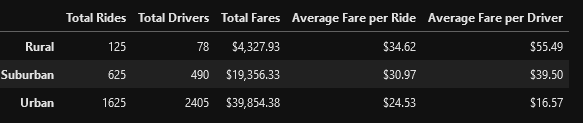

# PyBer Ride-Share Analysis

## Overview: 

While working for a ride-sharing app company, know as PyBer, our manager has assigned us the task of taking the database of ride-share data, analyzing and condensing the data into charts and graphs to draw conclusions. We are looking to making a summary dataframe then using the data to create a line graph.

## Results: 

Looking at the summary of the data, we can see that urban cities make up the bulk of total fares while rural areas have the least. That being said the margins for drivers in rural areas are better while it is the opposite for those in urban areas. The amount of drivers in all city types seem a little too close to the total rides as it may affect the amount drivers can make.

Looking at the line graph, the most fare is collected during the month of March. Rural and Urban areas also experience a spike in fare in April which the Suburban market doesn't experience.

## Summary: Based on the results, provide three business recommendations to the CEO for addressing any disparities among the city types.

One idea to consider is to reduce rural prices to stimulate use of the app as the amount of rides per month is about 30. Decreasing the price of fares may increase total fares collected. Another idea is to increase urban prices as based on the average fare, rides in the urban area are shorter so this would serve to increase total fares. It may prove helpful to reduce total drivers. The ratio of drivers to total rides is about 4 to 5 in rural and suburban and an even higher 7 to 5 in urban cities. Reducing this may detract from total fares but it will give more incentive to drivers as they will have more opportunies to receive fares. 
